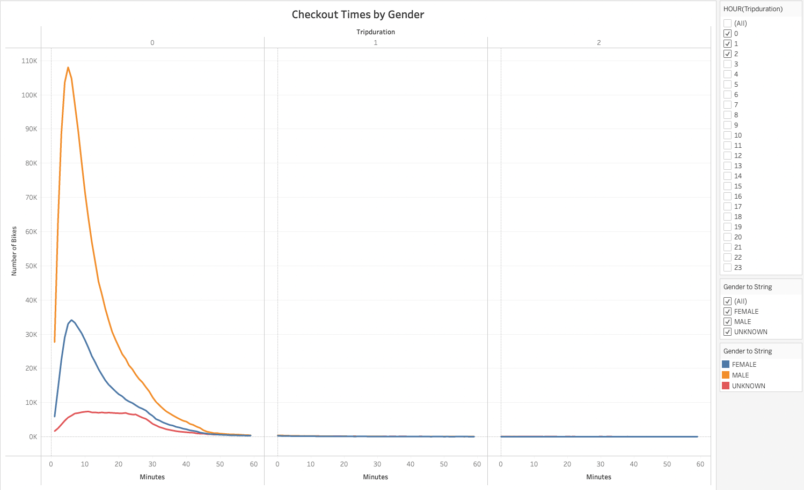

# Citi_Bike_Tableau
Module 15 Challenge for NYC Citi Bike ride share data. 

[Link to Tableau Dashboard](https://public.tableau.com/app/profile/michael.cicchino/viz/CitiBike_Challenge_16747907410450/CitiBikeStory?publish=yes)

## Purpose 

The purpose of this analysis is to vizualize Citi Bike data for NYC using Tableau. Using Tableau allows you to easily construct stylized charts and graphs from a dataset. However, it is mainly a visualization tool. So we first clean the data in python using pandas dataframes. 

## Data Preparation

First using jupyter notebook, python, and pandas. We cleaned the dataset and convert the tripduration variable to a DateTime data type. 

## Analysis  

# 1. Checkout Times for Users 

The image below provides a chart showing the duration of the trip within the first 3 hours. 

# 2. Checkout Times for Users by Gender

The image below provides a chart showing the duration of the trip within the first 3 hours broken out by Gender. 

# 3. Trips by Weekday per Hour

The image below displays a heatmap of trips per Weekday by the Hour. 

# 4. Trips by Weekday per Hour by Gender

The image below displays a heatmap of trips per Weekday by the Hour by Gender.

# 5. User Trips by Weekday per Hour by Gender

The image below displays a map of different User types for trips per Weekday by Gender.

# 6. Top Starting Locations Map

The image below displays a map of of the top starting locations in NYC.

# 7. Ride per Hour of Day ( Peak Ride Hours in August)

The image below displays a map of the amount of rides by each hour. Providing insight of when the bikes are most used. 

## Summary

It's not a suprise of why Tableau has become popular within many industries. It is a great resource for visualizing and telling the story of data after the raw data has been cleaned. 

